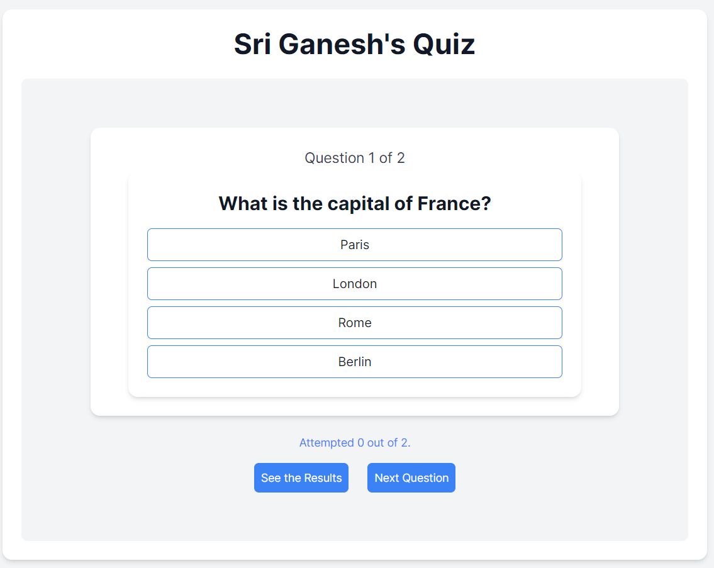

# Quiz App

A simple quiz application built using Next.js. This application allows users to answer multiple-choice questions and see their scores. The app is designed to provide a seamless and interactive user experience.

## Features

- Multiple-choice questions
- Highlight selected answers
- Circular navigation through questions
- Display the number of questions attempted
- Show final score after submission

## Tech Stack

- [Next.js](https://nextjs.org/)
- [React](https://reactjs.org/)
- [Tailwind CSS](https://tailwindcss.com/)

## Screenshots



## Getting Started

### Prerequisites

Make sure you have the following installed on your local machine:

- [Node.js](https://nodejs.org/) (v12 or later)
- [npm](https://www.npmjs.com/) or [Yarn](https://yarnpkg.com/)

### Installation

1. Clone the repository:

    ```sh
    git clone https://github.com/your-username/quiz-app.git
    cd quiz-app
    ```

2. Install dependencies:

    ```sh
    npm install
    # or
    yarn install
    ```

### Running the App

To start the development server:

```sh
npm run dev
# or
yarn dev
